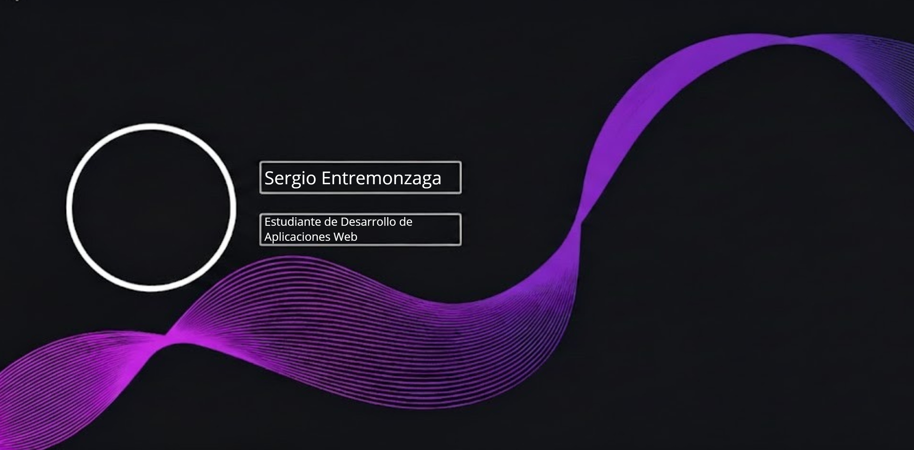

### 👋 Hola, mi nombre es Sergio Entremonzaga 
---
## Sobre mí
Soy estudiante de desarrollo de aplicaciones web en el instituto [Ies Luis Vives](https://www.iesluisvives.es)

Aparte de mi interés por el desarrollo de aplicaciones, también disfruto **gastando** mi tiempo libre:
- Leyendo 📖
- Jugando videojuegos 🎮
- Viendo cine 🚬
- Escuchando música 🎵

En esta cuenta iré subiendo mis proyectos para el grado y vocacionales ⌨️  
No dudes en darme consejos para mejorar 💪

---

### Estoy aprendiendo:

